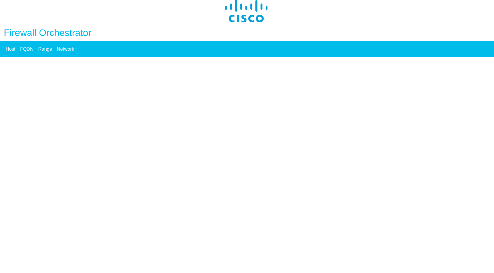

# FW Orchestrator

The goal of the project is to provide the tool for collecting information about objects from several Cisco ASA or FTD devices.

## FW Orchestrator License

This license is free, enables our customers and partners to do everything they need to do with the code, but also provides Cisco the limitations and protections we need in order to keep the policy and process requirements for sample code sharing as lightweight and streamlined as possible.

## Installation

Ubuntu installation:

```shell
$ python3 -m venv venv
$ source venv/bin/activate
$ pip3 install -r requirements.txt
```

## Configuration

Scripts are expected to be executed in a trusted environment with proper security settings. Credentials for access to ASA/FTD are stored in engine/config.py. Inventory is held in hosts.py.

## Launching

WSGI server is recommended for production environment. For test and development use:
```shell
$ python3 main.py
```
WebUi is accessible at http://0.0.0.0:5000 by default.
